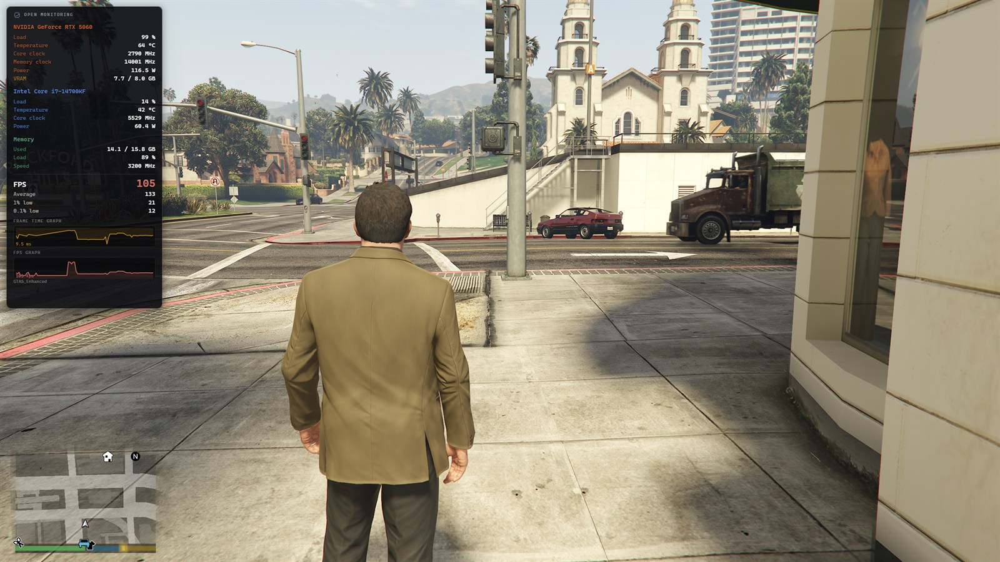
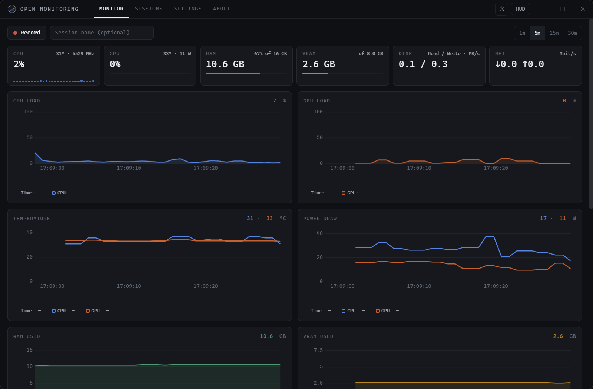
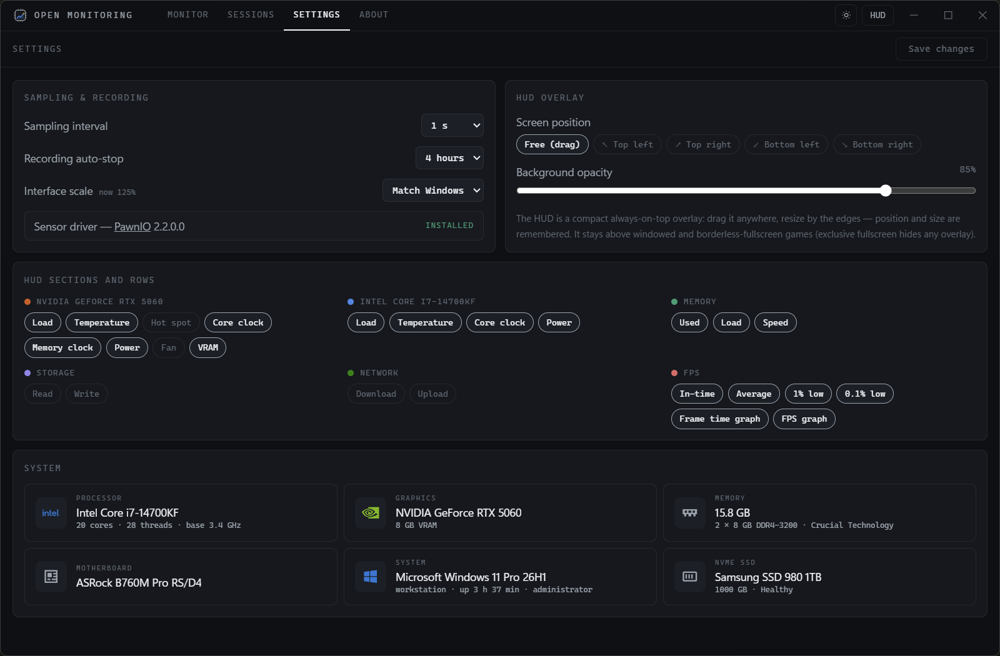
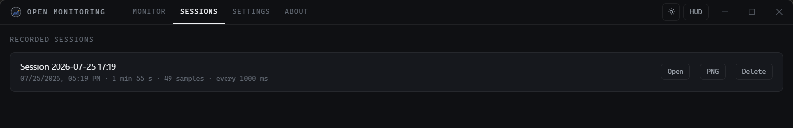
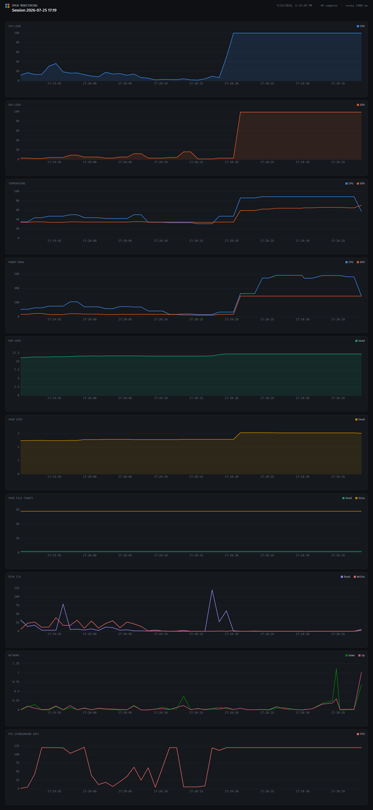

<p align="center"></p>

# Open Monitoring

Free and open-source PC monitoring for Windows — an alternative to MSI
Afterburner / FPS Monitor. Live dashboard, recordable sessions with zoomable
charts, and an always-on-top HUD overlay for games. One executable, nothing to
install alongside it.

**[Download](https://github.com/alexdedyura/open-monitoring/releases/tag/latest)**
· **[Documentation](https://alexdedyura.github.io/open-monitoring/)**

## Screenshots

The HUD over a running game — GPU, CPU and memory readouts, FPS with 1% / 0.1%
lows, and live frame-time and FPS graphs:



| Live dashboard | Settings and system panel |
|---|---|
|  |  |

Recordings are listed on their own tab — open one as zoomable charts, or export
the whole thing as a single image:



<details>
<summary><b>A recorded session, exported as one PNG</b> — every metric over the
whole recording, including the moment a game starts.</summary>



</details>

## Features

- **Live dashboard** — CPU (total and per-core), RAM, page file, GPU, VRAM,
  disk I/O and network as streaming charts with 1m/5m/15m/30m windows. Dark and
  light themes, both colorblind-validated, and the interface follows the
  Windows display scaling (or can be pinned to 100–200%).
- **Every GPU vendor** — load, VRAM, temperature, hot spot, power draw, clocks
  and fan for NVIDIA, AMD and Intel, with no vendor tool installed.
- **FPS of the game you are playing** — current / average / 1% low / 0.1% low,
  measured by [Intel PresentMon](https://github.com/GameTechDev/PresentMon).
- **CPU clock, temperature and power** — the real boost frequency of the
  fastest core, plus package temperature and power draw.
- **Storage** — live read/write speed and free space per volume, and per drive
  the model, bus, health, SMART temperature, remaining life and power-on hours.
- **System panel** — a hardware summary at a glance: CPU, GPU, RAM modules,
  motherboard, OS and uptime, drives.
- **Recording** — capture every metric for 1–4 hours, then browse it as
  zoomable charts (drag to zoom, double-click to reset) or export every chart
  as one shareable PNG snapshot.
- **HUD overlay** — a compact frameless overlay styled like a classic in-game
  OSD: sections per hardware with per-row toggles, FPS and frame-time
  sparklines, adjustable opacity and screen anchoring. Works over windowed and
  borderless-fullscreen games.

## Download

Every push to the default branch is built by GitHub Actions and published to
the rolling [**latest** release](https://github.com/alexdedyura/open-monitoring/releases/tag/latest):

- **Installer** (`open-monitoring-amd64-installer.exe`) — Start-menu and
  desktop shortcuts, an uninstaller, and the required PawnIO driver as a
  component that is selected by default.
- **Portable** (`open-monitoring.exe`) — a single file, no prerequisites; the
  PawnIO driver is offered on first launch.

Windows 10/11, 64-bit. The app asks for administrator rights at launch — SMART
counters and frame capture need them, same as MSI Afterburner.

## The PawnIO driver

CPU package temperature and power can only be read from ring 0, so they need a
kernel driver. Open Monitoring never installs one of its own: it relies on
[PawnIO](https://pawnio.eu), a small open-source driver that the installer sets
up for you, or that the app offers to install with one click on first launch
(via `winget`). Until it is present the app stays on the install screen.

More on why, and what to do if winget is unavailable, in the
[PawnIO documentation](https://alexdedyura.github.io/open-monitoring/pawnio).

## Building from source

Requirements: Go 1.25+, Node.js 18+, the
[Wails CLI](https://wails.io/docs/gettingstarted/installation) v2 and the .NET 8
SDK (for the sensor helper — end users do not need .NET).

```powershell
.\build.ps1
```

The result is `build/bin/open-monitoring.exe`, around 50 MB, with no loose files
beside it. See the
[building guide](https://alexdedyura.github.io/open-monitoring/building) for the
options and the
[metrics reference](https://alexdedyura.github.io/open-monitoring/metrics) for
how the data is collected.

## Roadmap

- Global hotkey for HUD toggle
- Per-process metrics
- Russian localisation

## License

[GPL-3.0](LICENSE).
